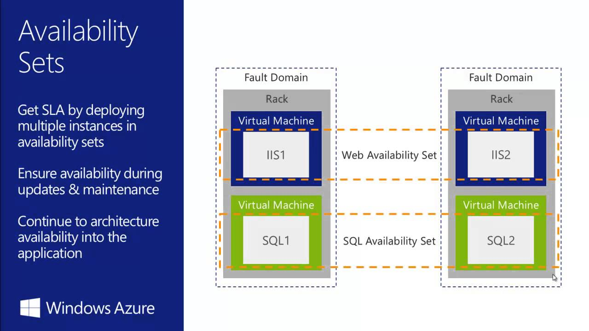

# AZ-900-Microsoft-Fundamentals
Materials come from AZ-900 Microsoft Fundamentals Bootcamp

# Skills measured
Describe cloud concepts (15-20%)  
Describe core Azure services (30-35%)  
Describe security, privacy, compliance, and trust (25-30%)  
Describe Azure pricing Service Level Agreements, and Lifecycles (20-25%)  

# Section: 2. Basis. Cloud Computing Models. Regions, AZ, Management Infrastructure

Section 2: Cloud Deployment models. Private and Public clouds.

Section 2: Cloud Computing Models. Regions, Availability Zones (AZ), Availability Sets. Azure Management Interfaces.

## Cloud Computing Models. IaaS (rent a car), PaaS (take a taxi), SaaS (use the bus).
[Cloud Computing Models PDF](pdf-files/section-2/2.4+Cloud+Computing+Models.pdf)
1. SaaS works on a subscription based model - pay annually or monthly.  

* Cloud Advantages against other solutions:  
[Advantages of Cloud Computing PDF](pdf-files/section-2/2.5+Advantages+of+Microsoft+Azure+Cloud+Computing.pdf)

## Economies of Scale. CapEx (Capital Expenditure) vs OpEx (Operational Expenditure)
[Economies](pdf-files/section-2/2.6+Understanding+CapEx+versus+OpEx.+Economies+of+Scale..pdf)
* Upfront investments - buying taxis. And, after upfront investments, the value reduces over time.  
* If you go on your own in your business - then you will pay more. You will pay less with Azure.  

## Regions, Availability Zones (AZ), Availability Sets
[Regions and AZ PDF](pdf-files/section-2/2.7+Azure+Global+Infrastructure+-+Regions+and+Availability+Zones.pdf)
[Some additional information via link PDF](https://heranonazure.wordpress.com/2019/02/12/azure-infrastructure-geographies-regions-zones-datacenters/)

* Region us a part of one Geography + Specific service availability.  
Example of Geographies: In America there are 4 geographies: United States, Azure Government, Canada, Brazil.  

* AZ - physically separate datacenters withing Azure Region, with independent power, network and cooling.   
Example: In West Europe Region there are 3 different AZ zones - AZ-1, AZ-2, AZ-3. They are interconnected by low-latency links.  
Required for mission-critical applications.

* Availability Sets - is a logical grouping of two or more VMs within a DataCenter that allows Azure to understand
 how your App is build to provide redundancy and availability.
1. With Availability Sets, Azure will split your pool of VMs on different racks of servers which called "Fault Domains"
 to prevent app outage in case of unplanned maintenance events (power, hw failure, etc). Racks is really different in the datacenter.
2. The main idea - if Azure need to update the hardware or software in Fault Domain 1 - your site still be available.

* Region Pairs - For disaster compliance.  When the entire Azure Region goes down - you can recover your app using another Region which is in a pair with yours.  

* Azure Government

* Azure China

## Azure Management Interfaces
[Azure Management PDF](pdf-files/section-2/2.8+Azure+Management+Interfaces+-+How+to+Interact+with+Azure+Cloud+Platform.pdf)  
* Azure Portal

* Azure CLI (Command Line Interface) - console for Windows\Mac\Linux
* Azure PowerShell module - mostly the same as a CLI option. Also, it is a console with additional command line abilities.  
Allow you to use scripts and make some automations.  

* Azure Cloud Shell
Browser-accessible pre-configured virtual machine (all required applications is already installed)  
1. Accessible from Azure Portal, from shell.azure.com and from Azure Mobile App.  

* Azure SDK
Collections of libraries for developers.

* Azure Mobile App
Monitoring the health and servers statuses, Run commands, diagnose and fix issues.

Section 2: Azure Subscriptions. Management Groups + Azure Resource Hierarchy.

* In enterprise world there could be several kinds of subscriptions: Development subscription, testing subscription, production subscription

* One azure account you can have one or more subscriptions.

### Azure Subscriptions. Why we have to use subscription
* Billing Boundaries: Billing Boundaries will help you to organize and control your costs using billing reports, invoices etc.
* Access Control Boundaries: Apply access policies at the different subscription levels + control different resources.

In details:
Azure Subscription is for:
1) Environment separation: Dev environment, Testing env, Prod env.
2) Create distinct organizational structures: HR, Marketing, Management, IT etc. Subscription per department.
3) Billing purposes: aggregate costs per subscription
4) Subscription limitation: set some restrictions per subscription, for example 10vCPU per subscription, other hard limits.

Another Azure Subscription Offers like $200 credit in 30 first days.

### Management Groups. Azure Resource Hierarchy
Azure Resource Hierarchy:
1) Management Groups - is a container for multiple subscriptions.   
  Root Management Group -> Per Department Management Group + Subscriptions
2) Subscriptions - can have Resource Groups. 
3) Resource Groups - can have Resources (which you can deploy in Azure: SQL DBs, VMs, etc).  
  In my next practise it will be named "AZ900 Resource Group".
4) Resources: SQL DBs, VMs, etc.

## Section 2 Exam Hints
[exam hints PDF](pdf-files/section-2/2.9+Module+Completion+&+Exam+Hints.pdf)

# Section 3. Azure Core Services. Virtual Machines. Azure Managed Disks. Application Security Group (ASG). Network Security Group (NSG).

Section 3: Practical lessons. Launch VMs, NSG, ASG, Load Balancer

### Create Virtual Machine using Ubuntu canonical image:

### Connect to VM using Linux or Windows PC:
#### For windows PC you have to use any SSH Client. Either to use RDP Connection
#### For linux you just have to use SSH connection

#### VM configuration as WebServer
1. sudo su - update your privileges
2. sudo apt update - update all pre-installed packages to the last versions
3. sudo apt apache2 - apache for linux web server.
4. sudo systemctl status apache2 - to check is apache running

4.1. to test that everything is ok - curl localhost - will check will apache make a response us.
4.2 create(mostly update) index.html page:  
`cd /var/www/html`  
`ls`  
`rm index.html` -- remove previous html file
`nano index.html` - create your own html file:
`<html><body><h1>Webserver 01</h1></body></html>`
5. NSG configuration

## Virtual Machines. (Availability sets described above)
[Virtual Machines PDF](pdf-files/section-3/3.4+Introduction+to+Azure+Virtual+Machines.pdf)
* Azure Virtual Machines represent **IaaS** Computing Model.  
The most flexible option.
Types:
1. General Purpose - (Balanced CPU and Memory)  
2. Compute Optimized - (High CPU, lower memory)  
3. Memory Optimized - (High memory, lower CPU)  
4. Storage Optimized - (High disk throughput and IOPS)  
5. GPU - (Heave rendering traffic)  
6. High Performance Compute - (Most Powerful CPUs)  

[More information about sizes link](https://docs.microsoft.com/en-us/azure/virtual-machines/sizes-general)

## Virtual Machines Networking, VMs High Availability. Vnet.
[Virtual Networking, VM, High Availability. PDF](pdf-files/section-3/3.5+Azure+VMs+Networking+and+High+Availability+Fundamentals+101.pdf)
* vNET - Azure Virtual Networks. Enable to communicate between VMs and over the internet with you on-prem machines.
* vNET - is equivalent of **VPC** in AWS Cloud.
* Allow you using SSH to connect to your Virtual Machines throw Public IP address inside your vNET.

* Virtual Machine Scale Sets - group of identical VMs under Load Balancer.
 The number of instances can be automatically increase and decrease according network load.

**Bear in mind! They can be stored in a same AZ**

* Azure Batch - large-scale job scheduler. Let you make huge jobs, creating and managing tens\hundreds\thousands of VMs (pools of VMs) under the hood.

## Azure Managed Disks.
* Azure managed disks are block-level storage volumes that are managed by Azure and used with Azure Virtual Machines.  
Managed disks are like a physical disk in an on-premises server but, virtualized.
**Azure will provision the disk on their own, you just specify the size of your virtual disk**
[More information about disks link](https://docs.microsoft.com/en-us/azure/virtual-machines/managed-disks-overview)
* 4 disk types to aim the specific customer scenarios:
1. Ultra disk (IO-intensive: SQL, Oracle and other transaction-heavy workloads)
2. Premium SSD (Production)
3. Standard SSD (Web services, lightly enterprise apps)
4. Standard HDD  (Backups, non-critical apps)

### Azure Network, Application Security Groups, Network Security Groups (NSGs)
[Additional info Link](https://www.kainos.com/microsoft-azure-nsgs-asgs-simplified/#:~:text=The%20difference,within%20a%20Network%20Security%20Group.)
### ASG vs NSG (difference)
* Network Security Group is the Azure Resource that you will use to enforce and control the network traffic with,  
  whereas Application Security Group is an object reference within a Network Security Group.
  
 
#### Network Security Groups (NSGs)
NSG’s control access by permitting or denying network traffic in a number of ways, whether it be
[Network and Security Groups](pdf-files/section-3/3.10+Azure+Network+and+Application+Security+Groups+Fundamentals+101.pdf)
* Azure Network Security Groups act as a firewall for your VMs. Controls inbound and outbound traffic
* Works on subnet level or Network Interface Card (NIC)
* Different VMs can have different NSGs applied
* You can add rules to your NSG.

#### Application Security Groups
ASGs are used within a NSG to apply a network security rule to a specific workload or group of VMs – defined by ASG worked  
 as being the “network object” & explicit IP addresses which are added to this object.  
    
   This provides the capability to group VMs into associated groups or workloads, simplifying the NSG rule definition process.  
 
   Another great use of this is for scalability, creating the virtual machine and assigning the newly created the virtual machine 
 to its ASG will provide it with all the NSG rules in place for that specific ASG – zero distribution to your service!
  
* Allows you to group your virtual machines and define network security policies for them.
* You add rules that control inbound traffic to instances and separate rules that control outbound traffic

# Section 3. Load Balancer

Section 3: Practical lessons. Launch VMs, NSG, ASG, Load Balancer

## Azure Load Balancer Fundamentals
[Load Balancer](pdf-files/section-3/3.12+Azure+Load+Balancer+Fundamentals+101.pdf)
Let you equally distributing load to a group of servers (backend servers pool)

#### How to apply Load Balancer

1. Create and Configure Load balancer 
2. Define Frontend pool - pool of your FE servers.
3. Health probe - probe which controls your FE servers (is your server in a good condition and ready to work)
4. Load Balancer Rules - for example wait request on 80 port (HTTP) from outside (Internet) and send it via 443 port (HTTPS)) to your backend pool (Frontend Web Servers).

#### Load Balancer + Virtual Machine
1) Create Public Load Balancer
1.2) Create Backend Pool
1.3) Create Health Probe for LB
2) Create WebServers and Attach it to Load Balancer
2.1) Configure Inbound Port rules for webservers

3) Connect to your Webservers via SSH, update them, install Apache and so on.

**Azure Traffic Manager is DNS-based traffic load balancer**
[Azure Traffic Manager - DNS LOAD BALANCER](pdf-files/section-3/3.15+Azure+Traffic+Manager+Basics+101.pdf)

* Works with Hybrid cloud deployment  - On + Premise + Azure Cloud. It can monitor your resources availability.
* Able to work between different regions.
* If you have 2 different regions - it can decide what the resource is the most suitable for end user (depending on latency)
* If your destination region in not available - can switch end user to another region.

Section 3: Exam Hints

**Section 3 Exam Hints:**  
[Exam Hints](pdf-files/section-3/3.16+Module+Completion+&+Exam+Hints.pdf)
* SLA - Service Level Agreement
* DC - Data Center
* VMSS - Virtual Machine Scale Sets - work only with Load Balancer
* NSG - Network security Group - is a virtual firewall for your VMs. Different VMs can have Different NSGs applied. Tied with port configuration rules (Inbound & outbound traffic).  
In other words - your network security rules destination is Virtual Network with your VMs.
* ASG - Application Security Group - is a group of VMs with defined security policies for whole group.  
In other words - your network security rules destination is a dedicated group of selected VMs.  

* Load Balancer could be internal Load Balancer - Within Azure Cloud, between your servers and SQL DBs.

# Section 4. Azure Compute Options. Virtual Machines vs Docker Containers. App Service.

Section 4: Azure Compute Options

Azure Compute Options, Introduction:  
[Azure Compute Options](pdf-files/section-4/4.2+Azure+Compute+Options+Introduction.pdf)  

Azure Containers Materials:  
[Azure Containers 101](pdf-files/section-4/4.3+Azure+Containers+Fundamentals+101.pdf)  

VM:
1) VMs need infrastructure (server in Data Center)
2) We need Host Operating System, i.e. Windows \ Linux \ Mac.
3) We need Hypervisor: VMware, ESXi.
4) You may do whatever you want with your VM - install different libraries, apps, update some apps.  

Containers:  
1) Containers also need infrastructure
2) Containers need Host Operating System: any kind of Linux OS.
3) Instead of Hypervisor we need Docker Container Daemon - It's a process which runs behind the scenes in a Host Operating System. Managed and runs containers.
4) Everything packed inside container: dependencies, binaries and so on. These apps packed into images.  

Comparing Containers and VMs:  
1) Containers boot time - much faster than VM boot time
2) VMs have Guest OS. Containers have no Guest OS.
3) VMs Resource Demanding is high (CPU, RAM, Storage). Containers Resource Demanding is pretty low.
4) VMs isolate your systems (environments). Containers isolate your applications.    

* To run containers in Azure you might use Azure Container Instances (ACI).
* ACI - is PaaS. Allows you to upload and use your containers. ACI is good for a couple of containers. 
* AKS is good for a fleet of them.

**Tips:**
1) when you create a container - you have to text the image name. Name should be - mcr.microsoft.com/YOUR_SELECTED_CATALOG/ACI_OR_CONTAINER_NAME.  
YOUR_SELECTED_CATALOG - is not required in simple cases.
2) DNS Label name - you have to select the container name to reach it after that using http. <b>This name should be unique!</b>
2.1) It's cool when <b><u>Container name</u></b> and his <b><u>DNS name label</u></b> are similar.
3) To reach your container you have to copy FQDN (Fully Qualified Domain Name) and pass it into your browser URL.

Section 4: App Service (PaaS) - host WebApp, RestAPI, Mobile BE.

App service is PaaS.  
Pricing is based on a selected Plan. 3 Plan options (1 of them is free and shared).  

Usage:  
1) You can use App service if you don't want to configure VMs and don't care about infrastructure. Just upload your code to Azure and this code will be run.   
1.1) You can upload your code from a github.
2) You can use App Service to Build & Deploy your web apps faster. You can scale your apps easier. With App Service you can use containerized web apps as well.
3) You can get access to App Service and use it using Azure Cloud Shell (terminal right on the Azure Portal). Or using App Service menu.

Course Doc:
[Azure App Service](pdf-files/section-4/4.5+Azure+App+Service+Fundamentals+101.pdf)  

Section 4: Serverless: Azure Functions. Azure Logic Apps.

* HA - High Availability.
Serverless ideas:
1) App code runs based on triggers or events (run function when it receives a Http Request)
2) Pay only for the duration your code runs.  

Azure Function vs Azure Logic App.
1) Function runs a small piece of code triggered by event. Logic Apps Automate and orchestrate tasks. Function executes code while Logic App executes workflows (using prebuilt logic blocks)
Workflow is to visualize, design, build and automate business processes as series of steps.
2) Logic Apps is for situations when you need to integrate apps, data, systems and services across enterprises.
3) Logic App could be a part of Schedule or Schedule itself.
4) Logic App could be created using Azure Portal Visual Designer or Visual Studio.

Logic Apps Example:  

Real example:
Using the Logic App designer on the portal -> select RSS -> RSS Trigger on feeds.reuters.com/reuters/topNews -> then send an email on selected email.

Course Doc:
[Azure App Service](pdf-files/section-4/4.7+Azure+Serverless+Computing+Fundamentals+101.pdf)  

Section 4: Azure Event Grid.

Allows you to build applications with event-based architectures.

Course Doc:
[Azure Event Grid](pdf-files/section-4/4.10+Azure+Event+Grid.pdf)  

Example: 
You subscribed to Azure Resource to know its status. For example - status of your VM.
In EventGrid world:
1) Select VM, Set EventHandler (set Logic App for example), if your VM stopped -> send an email with notification.
2) Select VM, Set EventHandler (set Logic App for example), if your VM stopped -> turn your VM on again. It's one of possible ways to prevent your VM from being stopped.

You can work with any Azure Portal events or define your own events.

**Section 4 Exam Hints:**  
Link to PDF: [Section-4 Exam Hints](pdf-files/section-4/4.10+Module+Completion+&+Exam+Hints.pdf)  
1) Azure Compute Options is an on-demand computing service.
2) 4 Options: VMs, Containers (Run with ACI or AKS), Azure App Service, ServerLess (Functions & Logic Apps)
3) ACI - Azure Container Instances. <b>Is PaaS</b>.
4) App Service - Http-based service for hosting web applications, REST APIs and mobile BE. <b>Is PaaS</b>. Based on your selected Plan (has free plan).
5) Serverless - is abstraction of servers. <b>Is PaaS</b>. You shouldn't worry how it runs in the cloud. High Availability. Event-Driven.
6) Logic Apps - your integration between business processes as a series of steps. (Example: Check RSS -> Get update -> Was Updated? Send an email. Everything in several clicks).

# Section 5. Azure Storage. Blob Storage. File Storage. Table Storage. Queue Storage.
## Azure Storage Fundamentals.
Link to PDF: [Section-5 Azure Storage Fundamentals](pdf-files/section-5/5.2+Introduction+to+Azure+Storage.pdf)  
* 4 Types:
1) Azure Blob Storage - BLOB is Binary Large Objects. It is a scalable object store.
Good for unstructured data (text or binary data).
Suitable for:  
1.1) Store images and files  
1.2) Store video and audio  
1.3) Log files  
1.4) for BackUp and Restore purposes. For disaster recovery use cases.  
2) Azure Files - managed file share
3) Azure Queues - messaging store
4) Azure Tables - NoSQL structured data

Section 5: Blob Storage. Azure Data Lake Storage Gen2

Link to PDF: [Section-5 Azure Blob Storage](pdf-files/section-5/5.3+Azure+Blob+Storage+Fundamentals+101.pdf)  

BLOB is Binary Large Objects. It is a scalable object store.
Good for unstructured data (text or binary data, but there is no hard restrictions).
## Suitable for:  
1.1) Store images and files  
1.2) Store video and audio  
1.3) Log files  
1.4) for BackUp and Restore purposes. For disaster recovery use cases.  

## Structure:  
Storage Account (unique namespace in Azure) -> Container (like a folder) -> Blob-files (your actual files)

* Files are accessible via HTTP/HTTPS protocol.
* Support thousands of connections.

## Azure Data Lake Storage Gen2:
Azure Data Lake Storage Gen2 is a data analytics solution for the cloud.  
* It is built using two services: Azure Storage + Azure Data Lake Storage Gen1.
* Big Data analytics capabilities for structured and unstructured data.
* Scalable up to exabytes, 1M TB.
* Cost Effective

## Lifecycle and Access Tiers
Tiers:
1) Hot - frequently accessed data
2) Cool - infrequently accessed data (you have to store your data at min 30 days). Cheaper than Hot.
3) Archive - rarely accessed data (you have to store your data at stored min 180 days). Cheaper than Cool.

* Thus, we have multiple access tiers available, we can build a storage lifecycle policy (Cost-effective storage).
Policy: HOT -> COOL -> Archive.

## Encryption
Automatically encrypts your data in Azure.
2 ways:
1) Microsoft-managed encryption keys (Azure Storage Service Encryption - SSE)
2) Customer encryption keys (client-side encryption)

## Storage Replication
Azure always replicates data in your storage to ensure durability and high availability.
1) "Local-redundant storage", "LRS". Can be replicated within Data Center. will be replicated 3 times in your DataCenter.
2) "Zone-redundant storage", "ZRS". Across zonal Data Centers within region . Will be replicated on 3 storage clusters in all 3 AZs of the region.
3) "Geo-redundant storage" "GRS". Across geographically separated regions. Will be replicated to a secondary region (min 300 miles away.)
4) "Read-access geo-redundant storage", "RA-GRS". Provides read-only access in the secondary location. In Addition to "GRS".
Preview Replica Types:
5) "Geo-Zone-redundant storage", "DZRS" combines "ZRS" and "GRS". Data in 3 AZs in a 1st region and 1AZs in a 2nd region.
6) "Read-access geo-zone-redundant storage".

* Redundancy option can be selected when account is created.

 

Section 5: Azure Managed Disks Fundamentals 101 (Virtual Hard Drive For 1 VM) / Azure Files Storage (Disks to share info between VMs)

# Azure Managed Disks
Link to PDF: [Section-5 Azure Managed Disks](pdf-files/section-5/5.6+Azure+Managed+Disks+Fundamentals+101.pdf)  

## Suitable For:
Share files between Virtual Machines.

* Azure will manage the storage .VHD files (Virtual Hard Drives). It's just a volume where you can create a disk using "Disk Management" tool.

## Disk Options: 
1) Standard HDD
2) Standard SSD
3) Premium SSD
4) Ultradisk

## Disk Roles:
1) OS disk - has preinstalled OS
2) Temporary disk - short-term storage. Data can persist a VM reboot (in normal condition). Power off = data is lost.
3) Data disk

## Redundancy:
99.999% of availability
11th 9's -> local redundant storage
16th 9's -> Geo-ZRS 
* Disks are isolated from each other to avoid Single Point of Failure (SPOF)
* Fully integrated with AZ. They are protected from DataCenter failures.

 

* Assign specific permissions for a managed disk to one or more users.
* Every Azure VM machine comes with OS disk + Temp disk. And you are able to attach Data disk.

# Azure File Storage
Azure file storage is a storage which you may use to share persistent information between different Virtual Machines. 

Link to PDF: [Section-5 Azure File Storage](pdf-files/section-5/5.11+Azure+Files+Storage+Fundamentals+101.pdf)

## Structure:
Storage Account -> Azure Files -> files for Windows VM01 and Windows VM02.

## Info: 
* Azure File Shares con be mounted by both: On-Premise and Cloud machines.
* Access via SMB Protocol
* Can be mounted (attached) by any machines: on-premise and cloud machines.
* Work on Windows, Mac and Linux.
* Azure takes care of hardware and software updates + system patching
* Work with Azure CLI, Powershell.
* No Windows maintenance.

 

Section 5: Queue Storage

Link to PDF: [Section-5 Azure Queue Disks](pdf-files/section-5/5.13+Azure+Queues+Storage+Fundamentals+101.pdf)

## Suitable For:
* For storing large number of messages, accessible from anywhere.  
* For reliable messaging between application components.
* Provides asynchronous message queueing for communication between app components.

## Structure:
Storage Account -> Storage Queue -> Queue (Container for your messages.)  
Example of queue: incoming queue, outgoing queue, returned messages.  

Section 5: Tables Store. for NoSQL data

It's a "Key / attribute" storage with a schemaless design.  
Something like between Redis (key-value) and Mongo (BSON). Or even Excel.

Link to PDF: [Section-5 Azure Managed Disks](pdf-files/section-5/5.13+Azure+Queues+Storage+Fundamentals+101.pdf)

## Suitable For:
For storing structured NoSQL data, non-relational.

* Table will scale as demand increases.
* Doesn't have fixed data structure.

### Data Example:
.png)

## Structure:
Storage Account -> Table

## Info:
* Process up to 20.000 rows\s per Storage Account
* Process up to 2000\s per Table

**Section 5 Exam Hints:**  
Link to PDF: [Section-5 Exam Hints](pdf-files/section-5/5.15+Module+Completion+&+Exam+Hints.pdf)  

# Section 6. Databases in Azure

Section 6: Cosmos Database. Document Database

Link to PDF: [Section-5 Azure CosmosDB](pdf-files/section-6/6.2+Azure+Cosmos+Database+Fundamentals+101.pdf)
* Multi-model database service.
* It's a document DB. Format is JSON.
* Schema-agnostic, but generally classified as NoSQL database
* horizontally scalable.

## Key Features:
* Global Distribution - transparent multi-region distribution. It replicates your data in multi-region environment transparently.
* Regional presence - 56+ regions
* Highly available - 99.999%
* Elastic Scale
* Low latency guarantee (<10ms of 99% of requests)
* No Schema or index management. Can have different properties or formats.

## Multiple API available (Which technology is under the hood on your preference):
* SQL (core API) - Also has JSON Formatted documents, but works with SQL-query syntax.
* Cassandra
* MongoDB
* Gremlin
* Azure Table Storage

## Structure:
Database Account -> Database -> Container (Table \ Collection) -> Items (rows of data \ elements)

## Costs. Request Units (RUs):
* The cost of usage depends on Request Units - read, insert, delete, query.
* No matter how much CPU or RAM used.

## Partitions:
Items in a container are divided into distinct subsets called logical partitions. 

Section 6: SQL Database. Managed Service (like PaaS).

Link to PDF: [Section-5 Azure Database Fundamentals](pdf-files/section-6/6.4+Azure+SQL+Database+Fundamentals+101.pdf)
* general-purpose relational Database-as-a-service (DBaaS).
* Managed Service (like PaaS)

## Deployment Models:
* Single - isolated database, fully managed.
* Elastic Pool - collection of single databases with a shared set of resources.
* Managed instance - A fully managed instance of SQL Server. Full SQL server capabilities (vs Single) - Allows you to easy accommodate and migrate your database to the cloud.

* Azure SQL Database Server - is a center administrative point where you are able to configure your databases.

## Pricing Models:
* Database Transaction Unit (DTU) - With DTU you are able to scale storage with compute at the same time
* Virtual Core (vCore) - with vCore you are able to scale storage independently of compute (virtual cores and storage).
* Serverless model - vCore based.

Tip: 
1) your traditional sql server license on On-premise database - may be used only with vCore model.
2) when you create SQL Database you must select Server - this Server is SQL SERVER.

Section 6:  MySQL. PostgreSQL

Link to PDF: [Section-6 MySQL](pdf-files/section-6/6.6+Azure+Database+for+MySQL+Basics+101.pdf)
Link to PDF: [Section-6 PostgreSQL](pdf-files/section-6/6.8+Azure+Database+for+PostgreSQL+Basics+101.pdf)

## MySQL
* HA
* Pay-as-you-go pricing

## Postgre deployment options:
* Single Server - allow only **vertical scaling**
* Hyperscale - **scales db horizontally** (multiple machines of the same type), faster responses on large datasets.  
It goes as a part of server group with coordinator node and worker node roles.

### Both dbs engines:
1) support automatic backups
2) built-in security: in-motion or at-rest.

Section 6: Azure SQL Managed Instance ("AZURE SQL"). PaaS. Expensive! Fully managed instance-as-a-service with 100% features of SQL Server Database

**EXPENSIVE CHOICE: minimum is 640eur per month for 4-vCore and 32GB of Storage**
**Deploying up to 6 hours**

Link to PDF: [Section-6 Azure SQL Managed Instance](pdf-files/section-6/6.10+Azure+SQL+Managed+Instance+Fundamentals+101.pdf)
* Fully managed isolated instance-as-a-service with 100% features of SQL Server Database.
* Best option for most migrations to Azure Cloud (let you shift your on-premise customers to the cloud).  
You literally can take your application as it is without modifying it and running it afterwards in the cloud.
* Reduce management overhead. Patching, versioning and updates.
* High availability. 99,99%

## Suitable For:
* On-premise applications which you would like to switch on Azure Cloud database (and migrate all data there).
* For modern applications as well created from scratch.

## Structure:
1) Network Group
2) Route table
3) Virtual network
4) Everything for databases

## Key Features and Benefits
* PaaS, quick provisioning and scaling.
* Combines best features of SQL database & Server Engine.
* 99,99% of availability. HA.
* vNet (virtual network) is not connected to your database. It's in isolated environment and isolated from another either.
* Azure Active Directory (AD) authentication. SSO Support.
* You can use Azure resource manager API for automating provisioning and scaling. (you can do provisioning manually or automatically via Azure resource manager API)

## Purchasing models
* vCore - allows you to change compute, memory and storage independently, based on your workload needs.
* Azure SQL Managed Instance is available in two service tiers (both options has 99,99% of availability):  
1) General Purpose
2) Business critical (low latency)

Section 6: Azure Database Migration Service. Seamless migrations from multiple database sources to Azure Cloud

* Migration Service is a service designed to enable seamless migrations from multiple database sources to Azure Cloud.
Link to PDF: [Section-5 Azure Database Migration](pdf-files/section-6/6.10+Azure+SQL+Managed+Instance+Fundamentals+101.pdf)

## Supported Databases for different scenarios:
Lost of scenarios described in the official doc. Different database sources and different available database destinations (in Azure of course).
[Microsoft Documentation for Azure Database Migration Service](https://docs.microsoft.com/en-us/azure/dms/resource-scenario-status)

## Key Features:
* Support different migration scenarios from on-premise to cloud database: offline (one-time) and online (continuous sync)

**Section 6 Exam Hints:**  
Link to PDF: [Section-6 Exam Hints](pdf-files/section-6/6.11+Module+Completion+&+Exam+Hints.pdf)  

