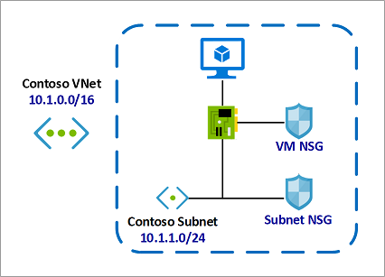

# AZ-900-Microsoft-Fundamentals
Materials come from AZ-900 Microsoft Fundamentals Bootcamp

# Skills measured
Describe cloud concepts (15-20%)  
Describe core Azure services (30-35%)  
Describe security, privacy, compliance, and trust (25-30%)  
Describe Azure pricing Service Level Agreements, and Lifecycles (20-25%)  

# Section: 2. Basis. Cloud Computing Models. Regions, AZ, Management Infrastructure

Section 2: Cloud Deployment models. Private and Public clouds.

Section 2: Cloud Computing Models. Regions, Availability Zones (AZ), Availability Sets. Azure Management Interfaces.

## Cloud Computing Models. IaaS (rent a car), PaaS (take a taxi), SaaS (use the bus).
[Cloud Computing Models PDF](pdf-files/section-2/2.4+Cloud+Computing+Models.pdf)
1. SaaS works on a subscription based model - pay annually or monthly.  

* Cloud Advantages against other solutions:  
[Advantages of Cloud Computing PDF](pdf-files/section-2/2.5+Advantages+of+Microsoft+Azure+Cloud+Computing.pdf)

## Economies of Scale. CapEx (Capital Expenditure) vs OpEx (Operational Expenditure)
[Economies](pdf-files/section-2/2.6+Understanding+CapEx+versus+OpEx.+Economies+of+Scale..pdf)
* Upfront investments - buying taxis. And, after upfront investments, the value reduces over time.  
* If you go on your own in your business - then you will pay more. You will pay less with Azure.  

## Regions, Availability Zones (AZ), Availability Sets
[Regions and AZ PDF](pdf-files/section-2/2.7+Azure+Global+Infrastructure+-+Regions+and+Availability+Zones.pdf)
[Some additional information via link PDF](https://heranonazure.wordpress.com/2019/02/12/azure-infrastructure-geographies-regions-zones-datacenters/)

* Region us a part of one Geography + Specific service availability.  
Example of Geographies: In America there are 4 geographies: United States, Azure Government, Canada, Brazil.  

* AZ - physically separate datacenters withing Azure Region, with independent power, network and cooling.   
Example: In West Europe Region there are 3 different AZ zones - AZ-1, AZ-2, AZ-3. They are interconnected by low-latency links.  
Required for mission-critical applications.

* Availability Sets - is a logical grouping of two or more VMs within a DataCenter that allows Azure to understand
 how your App is build to provide redundancy and availability.
1. With Availability Sets, Azure will split your pool of VMs on different racks of servers which called "Fault Domains"
 to prevent app outage in case of unplanned maintenance events (power, hw failure, etc). Racks is really different in the datacenter.
2. The main idea - if Azure need to update the hardware or software in Fault Domain 1 - your site still be available.

* Region Pairs - For disaster compliance.  When the entire Azure Region goes down - you can recover your app using another Region which is in a pair with yours.  

* Azure Government

* Azure China

## Azure Management Interfaces
[Azure Management PDF](pdf-files/section-2/2.8+Azure+Management+Interfaces+-+How+to+Interact+with+Azure+Cloud+Platform.pdf)  
* Azure Portal

* Azure CLI (Command Line Interface) - console for Windows\Mac\Linux
* Azure PowerShell module - mostly the same as a CLI option. Also, it is a console with additional command line abilities.  
Allow you to use scripts and make some automations.  

* Azure Cloud Shell
Browser-accessible pre-configured virtual machine (all required applications is already installed)  
1. Accessible from Azure Portal, from shell.azure.com and from Azure Mobile App.  

* Azure SDK
Collections of libraries for developers.

* Azure Mobile App
Monitoring the health and servers statuses, Run commands, diagnose and fix issues.

Section 2: Azure Subscriptions. Management Groups + Azure Resource Hierarchy.

* In enterprise world there could be several kinds of subscriptions: Development subscription, testing subscription, production subscription

* One azure account you can have one or more subscriptions.

### Azure Subscriptions. Why we have to use subscription
* Billing Boundaries: Billing Boundaries will help you to organize and control your costs using billing reports, invoices etc.
* Access Control Boundaries: Apply access policies at the different subscription levels + control different resources.

In details:
Azure Subscription is for:
1) Environment separation: Dev environment, Testing env, Prod env.
2) Create distinct organizational structures: HR, Marketing, Management, IT etc. Subscription per department.
3) Billing purposes: aggregate costs per subscription
4) Subscription limitation: set some restrictions per subscription, for example 10vCPU per subscription, other hard limits.

Another Azure Subscription Offers like $200 credit in 30 first days.

### Management Groups. Azure Resource Hierarchy
Azure Resource Hierarchy:
1) Management Groups - is a container for multiple subscriptions.   
  Root Management Group -> Per Department Management Group + Subscriptions
2) Subscriptions - can have Resource Groups. 
3) Resource Groups - can have Resources (which you can deploy in Azure: SQL DBs, VMs, etc).  
  In my next practise it will be named "AZ900 Resource Group".
4) Resources: SQL DBs, VMs, etc.

## Section 2 Exam Hints
[exam hints PDF](pdf-files/section-2/2.9+Module+Completion+&+Exam+Hints.pdf)

# Section 3. Azure Core Services. Virtual Machines. Azure Managed Disks. Application Security Group (ASG). Network Security Group (NSG).

Section 3: Practical lessons. Launch VMs, NSG, ASG, Load Balancer

### Create Virtual Machine using Ubuntu canonical image:

### Connect to VM using Linux or Windows PC:
#### For windows PC you have to use any SSH Client. Either to use RDP Connection
#### For linux you just have to use SSH connection

#### VM configuration as WebServer
1. sudo su - update your privileges
2. sudo apt update - update all pre-installed packages to the last versions
3. sudo apt apache2 - apache for linux web server.
4. sudo systemctl status apache2 - to check is apache running

4.1. to test that everything is ok - curl localhost - will check will apache make a response us.
4.2 create(mostly update) index.html page:  
`cd /var/www/html`  
`ls`  
`rm index.html` -- remove previous html file
`nano index.html` - create your own html file:
`<html><body><h1>Webserver 01</h1></body></html>`
5. NSG configuration

## Virtual Machines. (Availability sets described above)
[Virtual Machines PDF](pdf-files/section-3/3.4+Introduction+to+Azure+Virtual+Machines.pdf)
* Azure Virtual Machines represent **IaaS** Computing Model.  
The most flexible option.
Types:
1. General Purpose - (Balanced CPU and Memory)  
2. Compute Optimized - (High CPU, lower memory)  
3. Memory Optimized - (High memory, lower CPU)  
4. Storage Optimized - (High disk throughput and IOPS)  
5. GPU - (Heave rendering traffic)  
6. High Performance Compute - (Most Powerful CPUs)  

[More information about sizes link](https://docs.microsoft.com/en-us/azure/virtual-machines/sizes-general)

## Virtual Machines Networking, VMs High Availability. Vnet.
[Virtual Networking, VM, High Availability. PDF](pdf-files/section-3/3.5+Azure+VMs+Networking+and+High+Availability+Fundamentals+101.pdf)
* vNET - Azure Virtual Networks. Enable to communicate between VMs and over the internet with you on-prem machines.
* vNET - is equivalent of **VPC** in AWS Cloud.
* Allow you using SSH to connect to your Virtual Machines throw Public IP address inside your vNET.

* Virtual Machine Scale Sets - group of identical VMs under Load Balancer.
 The number of instances can be automatically increase and decrease according network load.

**Bear in mind! They can be stored in a same AZ**

* Azure Batch - large-scale job scheduler. Let you make huge jobs, creating and managing tens\hundreds\thousands of VMs (pools of VMs) under the hood.

## Azure Managed Disks.
* Azure managed disks are block-level storage volumes that are managed by Azure and used with Azure Virtual Machines.  
Managed disks are like a physical disk in an on-premises server but, virtualized.
**Azure will provision the disk on their own, you just specify the size of your virtual disk**
[More information about disks link](https://docs.microsoft.com/en-us/azure/virtual-machines/managed-disks-overview)
* 4 disk types to aim the specific customer scenarios:
1. Ultra disk (IO-intensive: SQL, Oracle and other transaction-heavy workloads)
2. Premium SSD (Production)
3. Standard SSD (Web services, lightly enterprise apps)
4. Standard HDD  (Backups, non-critical apps)

### Azure Network, Application Security Groups, Network Security Groups (NSGs)
[Additional info Link](https://www.kainos.com/microsoft-azure-nsgs-asgs-simplified/#:~:text=The%20difference,within%20a%20Network%20Security%20Group.)
### ASG vs NSG (difference)
* Network Security Group is the Azure Resource that you will use to enforce and control the network traffic with,  
  whereas Application Security Group is an object reference within a Network Security Group.
  
 
#### Network Security Groups (NSGs)
NSG’s control access by permitting or denying network traffic in a number of ways, whether it be
[Network and Security Groups](pdf-files/section-3/3.10+Azure+Network+and+Application+Security+Groups+Fundamentals+101.pdf)
* Azure Network Security Groups act as a firewall for your VMs. Controls inbound and outbound traffic
* Works on subnet level or Network Interface Card (NIC)
* Different VMs can have different NSGs applied
* You can add rules to your NSG.

#### Application Security Groups
ASGs are used within a NSG to apply a network security rule to a specific workload or group of VMs – defined by ASG worked  
 as being the “network object” & explicit IP addresses which are added to this object.  
    
   This provides the capability to group VMs into associated groups or workloads, simplifying the NSG rule definition process.  
 
   Another great use of this is for scalability, creating the virtual machine and assigning the newly created the virtual machine 
 to its ASG will provide it with all the NSG rules in place for that specific ASG – zero distribution to your service!
  
* Allows you to group your virtual machines and define network security policies for them.
* You add rules that control inbound traffic to instances and separate rules that control outbound traffic

# Section 3. Load Balancer

Section 3: Practical lessons. Launch VMs, NSG, ASG, Load Balancer

## Azure Load Balancer Fundamentals
[Load Balancer](pdf-files/section-3/3.12+Azure+Load+Balancer+Fundamentals+101.pdf)
Let you equally distributing load to a group of servers (backend servers pool)

#### How to apply Load Balancer

1. Create and Configure Load balancer 
2. Define Frontend pool - pool of your FE servers.
3. Health probe - probe which controls your FE servers (is your server in a good condition and ready to work)
4. Load Balancer Rules - for example wait request on 80 port (HTTP) from outside (Internet) and send it via 443 port (HTTPS)) to your backend pool (Frontend Web Servers).

#### Load Balancer + Virtual Machine
1) Create Public Load Balancer
1.2) Create Backend Pool
1.3) Create Health Probe for LB
2) Create WebServers and Attach it to Load Balancer
2.1) Configure Inbound Port rules for webservers

3) Connect to your Webservers via SSH, update them, install Apache and so on.

**Azure Traffic Manager is DNS-based traffic load balancer**
[Azure Traffic Manager - DNS LOAD BALANCER](pdf-files/section-3/3.15+Azure+Traffic+Manager+Basics+101.pdf)

* Works with Hybrid cloud deployment  - On + Premise + Azure Cloud. It can monitor your resources availability.
* Able to work between different regions.
* If you have 2 different regions - it can decide what the resource is the most suitable for end user (depending on latency)
* If your destination region in not available - can switch end user to another region.

Section 3: Exam Hints

**Section 3 Exam Hints:**  
[Exam Hints](pdf-files/section-3/3.16+Module+Completion+&+Exam+Hints.pdf)
* SLA - Service Level Agreement
* DC - Data Center
* VMSS - Virtual Machine Scale Sets - work only with Load Balancer
* NSG - Network security Group - is a virtual firewall for your VMs. Different VMs can have Different NSGs applied. Tied with port configuration rules (Inbound & outbound traffic).  
In other words - your network security rules destination is Virtual Network with your VMs.
* ASG - Application Security Group - is a group of VMs with defined security policies for whole group.  
In other words - your network security rules destination is a dedicated group of selected VMs.  

* Load Balancer could be internal Load Balancer - Within Azure Cloud, between your servers and SQL DBs.

# Section 4. Azure Compute Options

Section 4: Azure Compute Options

