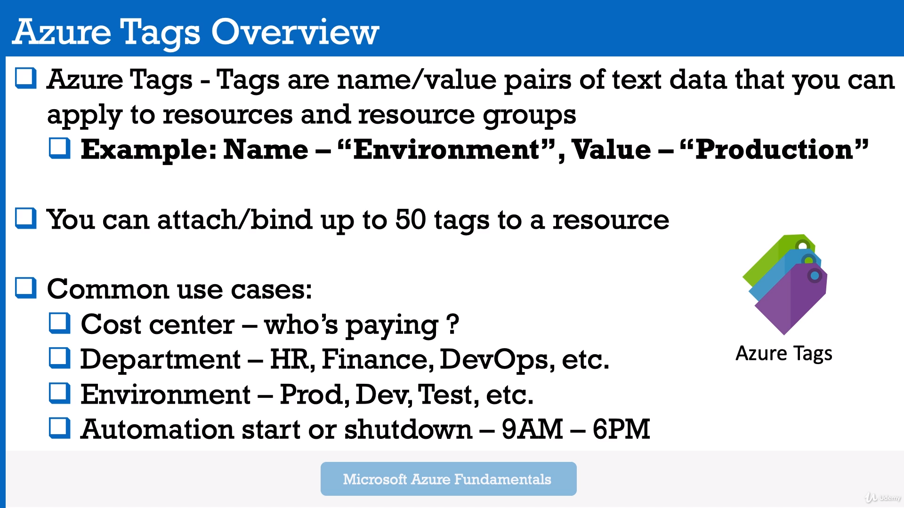

# AZ-900-Microsoft-Fundamentals
Materials come from AZ-900 Microsoft Fundamentals Bootcamp

# Skills measured
Describe cloud concepts (15-20%)  
Describe core Azure services (30-35%)  
Describe security, privacy, compliance, and trust (25-30%)  
Describe Azure pricing Service Level Agreements, and Lifecycles (20-25%)  

# Module: 2. Basis. Cloud Computing Models. Regions, AZ, Management Infrastructure

Module 2: Cloud Deployment models. Private and Public clouds.

Module 2: Cloud Computing Models. Regions, Availability Zones (AZ), Availability Sets. Azure Management Interfaces.

## Cloud Computing Models. IaaS (rent a car), PaaS (take a taxi), SaaS (use the bus).
[Cloud Computing Models PDF](pdf-files/module-2/2.4+Cloud+Computing+Models.pdf)
1. SaaS works on a subscription based model - pay annually or monthly.  

* Cloud Advantages against other solutions:  
[Advantages of Cloud Computing PDF](pdf-files/module-2/2.5+Advantages+of+Microsoft+Azure+Cloud+Computing.pdf)

## Economies of Scale. CapEx (Capital Expenditure) vs OpEx (Operational Expenditure)
[Economies](pdf-files/module-2/2.6+Understanding+CapEx+versus+OpEx.+Economies+of+Scale..pdf)
* Upfront investments - buying taxis. And, after upfront investments, the value reduces over time.  
* If you go on your own in your business - then you will pay more. You will pay less with Azure.  

## Regions, Availability Zones (AZ), Availability Sets
[Regions and AZ PDF](pdf-files/module-2/2.7+Azure+Global+Infrastructure+-+Regions+and+Availability+Zones.pdf)
[Some additional information via link PDF](https://heranonazure.wordpress.com/2019/02/12/azure-infrastructure-geographies-regions-zones-datacenters/)

* Region us a part of one Geography + Specific service availability.  
Example of Geographies: In America there are 4 geographies: United States, Azure Government, Canada, Brazil.  

* AZ - physically separate datacenters withing Azure Region, with independent power, network and cooling.   
Example: In West Europe Region there are 3 different AZ zones - AZ-1, AZ-2, AZ-3. They are interconnected by low-latency links.  
Required for mission-critical applications.

* Availability Sets - is a logical grouping of two or more VMs within a DataCenter that allows Azure to understand
 how your App is build to provide redundancy and availability.
1. With Availability Sets, Azure will split your pool of VMs on different racks of servers which called "Fault Domains"
 to prevent app outage in case of unplanned maintenance events (power, hw failure, etc). Racks is really different in the datacenter.
2. The main idea - if Azure need to update the hardware or software in Fault Domain 1 - your site still be available.

* Region Pairs - For disaster compliance.  When the entire Azure Region goes down - you can recover your app using another Region which is in a pair with yours.  

* Azure Government

* Azure China

## Azure Management Interfaces
[Azure Management PDF](pdf-files/module-2/2.8+Azure+Management+Interfaces+-+How+to+Interact+with+Azure+Cloud+Platform.pdf)  
* Azure Portal

* Azure CLI (Command Line Interface) - console for Windows\Mac\Linux
* Azure PowerShell module - mostly the same as a CLI option. Also, it is a console with additional command line abilities.  
Allow you to use scripts and make some automations.  

* Azure Cloud Shell
Browser-accessible pre-configured virtual machine (all required applications is already installed)  
1. Accessible from Azure Portal, from shell.azure.com and from Azure Mobile App.  

* Azure SDK
Collections of libraries for developers.

* Azure Mobile App
Monitoring the health and servers statuses, Run commands, diagnose and fix issues.

Module 2: Azure Subscriptions. Management Groups + Azure Resource Hierarchy.

* In enterprise world there could be several kinds of subscriptions: Development subscription, testing subscription, production subscription

* One azure account you can have one or more subscriptions.

### Azure Subscriptions. Why we have to use subscription
* Billing Boundaries: Billing Boundaries will help you to organize and control your costs using billing reports, invoices etc.
* Access Control Boundaries: Apply access policies at the different subscription levels + control different resources.

In details:
Azure Subscription is for:
1) Environment separation: Dev environment, Testing env, Prod env.
2) Create distinct organizational structures: HR, Marketing, Management, IT etc. Subscription per department.
3) Billing purposes: aggregate costs per subscription
4) Subscription limitation: set some restrictions per subscription, for example 10vCPU per subscription, other hard limits.

Another Azure Subscription Offers like $200 credit in 30 first days.

### Management Groups. Azure Resource Hierarchy
Azure Resource Hierarchy:
1) Management Groups - is a container for multiple subscriptions.   
  Root Management Group -> Per Department Management Group + Subscriptions
2) Subscriptions - can have Resource Groups. 
3) Resource Groups - can have Resources (which you can deploy in Azure: SQL DBs, VMs, etc).  
  In my next practise it will be named "AZ900 Resource Group".
4) Resources: SQL DBs, VMs, etc.

## Module 2 Exam Hints
[exam hints PDF](pdf-files/module-2/2.9+Module+Completion+&+Exam+Hints.pdf)

# Module 3. Azure Core Services. Virtual Machines. Azure Managed Disks. Application Security Group (ASG). Network Security Group (NSG).

Module 3: Practical lessons. Launch VMs, NSG, ASG, Load Balancer

### Create Virtual Machine using Ubuntu canonical image:

### Connect to VM using Linux or Windows PC:
#### For windows PC you have to use any SSH Client. Either to use RDP Connection
#### For linux you just have to use SSH connection

#### VM configuration as WebServer
1. sudo su - update your privileges
2. sudo apt update - update all pre-installed packages to the last versions
3. sudo apt apache2 - apache for linux web server.
4. sudo systemctl status apache2 - to check is apache running

4.1. to test that everything is ok - curl localhost - will check will apache make a response us.
4.2 create(mostly update) index.html page:  
`cd /var/www/html`  
`ls`  
`rm index.html` -- remove previous html file
`nano index.html` - create your own html file:
`<html><body><h1>Webserver 01</h1></body></html>`
5. NSG configuration

## Virtual Machines. (Availability sets described above)
[Virtual Machines PDF](pdf-files/module-3/3.4+Introduction+to+Azure+Virtual+Machines.pdf)
* Azure Virtual Machines represent **IaaS** Computing Model.  
The most flexible option.
Types:
1. General Purpose - (Balanced CPU and Memory)  
2. Compute Optimized - (High CPU, lower memory)  
3. Memory Optimized - (High memory, lower CPU)  
4. Storage Optimized - (High disk throughput and IOPS)  
5. GPU - (Heave rendering traffic)  
6. High Performance Compute - (Most Powerful CPUs)  

[More information about sizes link](https://docs.microsoft.com/en-us/azure/virtual-machines/sizes-general)

## Virtual Machines Networking, VMs High Availability. Vnet.
[Virtual Networking, VM, High Availability. PDF](pdf-files/module-3/3.5+Azure+VMs+Networking+and+High+Availability+Fundamentals+101.pdf)
* vNET - Azure Virtual Networks. Enable to communicate between VMs and over the internet with you on-prem machines.
* vNET - is equivalent of **VPC** in AWS Cloud.
* Allow you using SSH to connect to your Virtual Machines throw Public IP address inside your vNET.

* Virtual Machine Scale Sets - group of identical VMs under Load Balancer.
 The number of instances can be automatically increase and decrease according network load.

**Bear in mind! They can be stored in a same AZ**

* Azure Batch - large-scale job scheduler. Let you make huge jobs, creating and managing tens\hundreds\thousands of VMs (pools of VMs) under the hood.

## Azure Managed Disks.
* Azure managed disks are block-level storage volumes that are managed by Azure and used with Azure Virtual Machines.  
Managed disks are like a physical disk in an on-premises server but, virtualized.
**Azure will provision the disk on their own, you just specify the size of your virtual disk**
[More information about disks link](https://docs.microsoft.com/en-us/azure/virtual-machines/managed-disks-overview)
* 4 disk types to aim the specific customer scenarios:
1. Ultra disk (IO-intensive: SQL, Oracle and other transaction-heavy workloads)
2. Premium SSD (Production)
3. Standard SSD (Web services, lightly enterprise apps)
4. Standard HDD  (Backups, non-critical apps)

### Azure Network, Application Security Groups, Network Security Groups (NSGs)
[Additional info Link](https://www.kainos.com/microsoft-azure-nsgs-asgs-simplified/#:~:text=The%20difference,within%20a%20Network%20Security%20Group.)
### ASG vs NSG (difference)
* Network Security Group is the Azure Resource that you will use to enforce and control the network traffic with,  
  whereas Application Security Group is an object reference within a Network Security Group.
  
 
#### Network Security Groups (NSGs)
NSG’s control access by permitting or denying network traffic in a number of ways, whether it be
[Network and Security Groups](pdf-files/module-3/3.10+Azure+Network+and+Application+Security+Groups+Fundamentals+101.pdf)
* Azure Network Security Groups act as a firewall for your VMs. Controls inbound and outbound traffic
* Works on subnet level or Network Interface Card (NIC)
* Different VMs can have different NSGs applied
* You can add rules to your NSG.

#### Application Security Groups
ASGs are used within a NSG to apply a network security rule to a specific workload or group of VMs – defined by ASG worked  
 as being the “network object” & explicit IP addresses which are added to this object.  
    
   This provides the capability to group VMs into associated groups or workloads, simplifying the NSG rule definition process.  
 
   Another great use of this is for scalability, creating the virtual machine and assigning the newly created the virtual machine 
 to its ASG will provide it with all the NSG rules in place for that specific ASG – zero distribution to your service!
  
* Allows you to group your virtual machines and define network security policies for them.
* You add rules that control inbound traffic to instances and separate rules that control outbound traffic

# Module 3. Load Balancer

Module 3: Practical lessons. Launch VMs, NSG, ASG, Load Balancer

## Azure Load Balancer Fundamentals
[Load Balancer](pdf-files/module-3/3.12+Azure+Load+Balancer+Fundamentals+101.pdf)
Let you equally distributing load to a group of servers (backend servers pool)

#### How to apply Load Balancer

1. Create and Configure Load balancer 
2. Define Frontend pool - pool of your FE servers.
3. Health probe - probe which controls your FE servers (is your server in a good condition and ready to work)
4. Load Balancer Rules - for example wait request on 80 port (HTTP) from outside (Internet) and send it via 443 port (HTTPS)) to your backend pool (Frontend Web Servers).

#### Load Balancer + Virtual Machine
1) Create Public Load Balancer
1.2) Create Backend Pool
1.3) Create Health Probe for LB
2) Create WebServers and Attach it to Load Balancer
2.1) Configure Inbound Port rules for webservers

3) Connect to your Webservers via SSH, update them, install Apache and so on.

**Azure Traffic Manager is DNS-based traffic load balancer**
[Azure Traffic Manager - DNS LOAD BALANCER](pdf-files/module-3/3.15+Azure+Traffic+Manager+Basics+101.pdf)

* Works with Hybrid cloud deployment  - On + Premise + Azure Cloud. It can monitor your resources availability.
* Able to work between different regions.
* If you have 2 different regions - it can decide what the resource is the most suitable for end user (depending on latency)
* If your destination region in not available - can switch end user to another region.

Module 3: Exam Hints

**Module 3 Exam Hints:**  
[Exam Hints](pdf-files/module-3/3.16+Module+Completion+&+Exam+Hints.pdf)
* SLA - Service Level Agreement
* DC - Data Center
* VMSS - Virtual Machine Scale Sets - work only with Load Balancer
* NSG - Network security Group - is a virtual firewall for your VMs. Different VMs can have Different NSGs applied. Tied with port configuration rules (Inbound & outbound traffic).  
In other words - your network security rules destination is Virtual Network with your VMs.
* ASG - Application Security Group - is a group of VMs with defined security policies for whole group.  
In other words - your network security rules destination is a dedicated group of selected VMs.  

* Load Balancer could be internal Load Balancer - Within Azure Cloud, between your servers and SQL DBs.

# Module 4. Azure Compute Options. Virtual Machines vs Docker Containers. App Service.

Module 4: Azure Compute Options

Azure Compute Options, Introduction:  
[Azure Compute Options](pdf-files/module-4/4.2+Azure+Compute+Options+Introduction.pdf)  

Azure Containers Materials:  
[Azure Containers 101](pdf-files/module-4/4.3+Azure+Containers+Fundamentals+101.pdf)  

VM:
1) VMs need infrastructure (server in Data Center)
2) We need Host Operating System, i.e. Windows \ Linux \ Mac.
3) We need Hypervisor: VMware, ESXi.
4) You may do whatever you want with your VM - install different libraries, apps, update some apps.  

Containers:  
1) Containers also need infrastructure
2) Containers need Host Operating System: any kind of Linux OS.
3) Instead of Hypervisor we need Docker Container Daemon - It's a process which runs behind the scenes in a Host Operating System. Managed and runs containers.
4) Everything packed inside container: dependencies, binaries and so on. These apps packed into images.  

Comparing Containers and VMs:  
1) Containers boot time - much faster than VM boot time
2) VMs have Guest OS. Containers have no Guest OS.
3) VMs Resource Demanding is high (CPU, RAM, Storage). Containers Resource Demanding is pretty low.
4) VMs isolate your systems (environments). Containers isolate your applications.    

* To run containers in Azure you might use Azure Container Instances (ACI).
* ACI - is PaaS. Allows you to upload and use your containers. ACI is good for a couple of containers. 
* AKS is good for a fleet of them.

**Tips:**
1) when you create a container - you have to text the image name. Name should be - mcr.microsoft.com/YOUR_SELECTED_CATALOG/ACI_OR_CONTAINER_NAME.  
YOUR_SELECTED_CATALOG - is not required in simple cases.
2) DNS Label name - you have to select the container name to reach it after that using http. <b>This name should be unique!</b>
2.1) It's cool when <b><u>Container name</u></b> and his <b><u>DNS name label</u></b> are similar.
3) To reach your container you have to copy FQDN (Fully Qualified Domain Name) and pass it into your browser URL.

Module 4: App Service (PaaS) - host WebApp, RestAPI, Mobile BE.

App service is PaaS.  
Pricing is based on a selected Plan. 3 Plan options (1 of them is free and shared).  

Usage:  
1) You can use App service if you don't want to configure VMs and don't care about infrastructure. Just upload your code to Azure and this code will be run.   
1.1) You can upload your code from a github.
2) You can use App Service to Build & Deploy your web apps faster. You can scale your apps easier. With App Service you can use containerized web apps as well.
3) You can get access to App Service and use it using Azure Cloud Shell (terminal right on the Azure Portal). Or using App Service menu.

Course Doc:
[Azure App Service](pdf-files/module-4/4.5+Azure+App+Service+Fundamentals+101.pdf)  

Module 4: Serverless: Azure Functions. Azure Logic Apps.

* HA - High Availability.
Serverless ideas:
1) App code runs based on triggers or events (run function when it receives a Http Request)
2) Pay only for the duration your code runs.  

Azure Function vs Azure Logic App.
1) Function runs a small piece of code triggered by event. Logic Apps Automate and orchestrate tasks. Function executes code while Logic App executes workflows (using prebuilt logic blocks)
Workflow is to visualize, design, build and automate business processes as series of steps.
2) Logic Apps is for situations when you need to integrate apps, data, systems and services across enterprises.
3) Logic App could be a part of Schedule or Schedule itself.
4) Logic App could be created using Azure Portal Visual Designer or Visual Studio.

Logic Apps Example:  

Real example:
Using the Logic App designer on the portal -> select RSS -> RSS Trigger on feeds.reuters.com/reuters/topNews -> then send an email on selected email.

Course Doc:
[Azure App Service](pdf-files/module-4/4.7+Azure+Serverless+Computing+Fundamentals+101.pdf)  

Module 4: Azure Event Grid.

Allows you to build applications with event-based architectures.

Course Doc:
[Azure Event Grid](pdf-files/module-4/4.10+Azure+Event+Grid.pdf)  

Example: 
You subscribed to Azure Resource to know its status. For example - status of your VM.
In EventGrid world:
1) Select VM, Set EventHandler (set Logic App for example), if your VM stopped -> send an email with notification.
2) Select VM, Set EventHandler (set Logic App for example), if your VM stopped -> turn your VM on again. It's one of possible ways to prevent your VM from being stopped.

You can work with any Azure Portal events or define your own events.

**Module 4 Exam Hints:**  
Link to PDF: [Module-4 Exam Hints](pdf-files/module-4/4.10+Module+Completion+&+Exam+Hints.pdf)  
1) Azure Compute Options is an on-demand computing service.
2) 4 Options: VMs, Containers (Run with ACI or AKS), Azure App Service, ServerLess (Functions & Logic Apps)
3) ACI - Azure Container Instances. <b>Is PaaS</b>.
4) App Service - Http-based service for hosting web applications, REST APIs and mobile BE. <b>Is PaaS</b>. Based on your selected Plan (has free plan).
5) Serverless - is abstraction of servers. <b>Is PaaS</b>. You shouldn't worry how it runs in the cloud. High Availability. Event-Driven.
6) Logic Apps - your integration between business processes as a series of steps. (Example: Check RSS -> Get update -> Was Updated? Send an email. Everything in several clicks).

# Module 5. Azure Storage. Blob Storage. File Storage. Table Storage. Queue Storage.
## Azure Storage Fundamentals.
Link to PDF: [Module-5 Azure Storage Fundamentals](pdf-files/module-5/5.2+Introduction+to+Azure+Storage.pdf)  
* 4 Types:
1) Azure Blob Storage - BLOB is Binary Large Objects. It is a scalable object store.
Good for unstructured data (text or binary data).
Suitable for:  
1.1) Store images and files  
1.2) Store video and audio  
1.3) Log files  
1.4) for BackUp and Restore purposes. For disaster recovery use cases.  
2) Azure Files - managed file share
3) Azure Queues - messaging store
4) Azure Tables - NoSQL structured data

Module 5: Blob Storage (Azure Containers). Azure Data Lake Storage Gen2

Link to PDF: [Module-5 Azure Blob Storage](pdf-files/module-5/5.3+Azure+Blob+Storage+Fundamentals+101.pdf)  

BLOB is Binary Large Objects. It is a scalable object store.
Good for unstructured data (text or binary data, but there is no hard restrictions).
## Suitable for:  
1.1) Store images and files  
1.2) Store video and audio  
1.3) Log files  
1.4) for BackUp and Restore purposes. For disaster recovery use cases.  

## Structure:  
Storage Account (unique namespace in Azure) -> Container (like a folder) -> Blob-files (your actual files)

* Files are accessible via HTTP/HTTPS protocol.
* Support thousands of connections.

## Azure Data Lake Storage Gen2:
Azure Data Lake Storage Gen2 is a data analytics solution for the cloud.  
* It is built using two services: Azure Storage + Azure Data Lake Storage Gen1.
* Big Data analytics capabilities for structured and unstructured data.
* Scalable up to exabytes, 1M TB.
* Cost Effective

## Lifecycle and Access Tiers
Tiers:
1) Hot - frequently accessed data
2) Cool - infrequently accessed data (you have to store your data at min 30 days). Cheaper than Hot.
3) Archive - rarely accessed data (you have to store your data at stored min 180 days). Cheaper than Cool.

* Thus, we have multiple access tiers available, we can build a storage lifecycle policy (Cost-effective storage).
Policy: HOT -> COOL -> Archive.

## Encryption
Automatically encrypts your data in Azure.
2 ways:
1) Microsoft-managed encryption keys (Azure Storage Service Encryption - SSE)
2) Customer encryption keys (client-side encryption)

## Storage Replication
Azure always replicates data in your storage to ensure durability and high availability.
1) "Local-redundant storage", "LRS". Can be replicated within Data Center. will be replicated 3 times in your DataCenter.
2) "Zone-redundant storage", "ZRS". Across zonal Data Centers within region . Will be replicated on 3 storage clusters in all 3 AZs of the region.
3) "Geo-redundant storage" "GRS". Across geographically separated regions. Will be replicated to a secondary region (min 300 miles away.)
4) "Read-access geo-redundant storage", "RA-GRS". Provides read-only access in the secondary location. In Addition to "GRS".
Preview Replica Types:
5) "Geo-Zone-redundant storage", "DZRS" combines "ZRS" and "GRS". Data in 3 AZs in a 1st region and 1AZs in a 2nd region.
6) "Read-access geo-zone-redundant storage".

* Redundancy option can be selected when account is created.

 

Module 5: Azure Managed Disks (Dedicated Virtual Hard Drive Disk For 1 VM)

# Azure Managed Disks
Link to PDF: [Module-5 Azure Managed Disks](pdf-files/module-5/5.6+Azure+Managed+Disks+Fundamentals+101.pdf)  

## Suitable For:
Share files between Virtual Machines.

* Azure will manage the storage .VHD files (Virtual Hard Drives). It's just a volume where you can create a disk using "Disk Management" tool.

## Disk Options: 
1) Standard HDD
2) Standard SSD
3) Premium SSD
4) Ultradisk

## Disk Roles:
1) OS disk - has preinstalled OS
2) Temporary disk - short-term storage. Data can persist a VM reboot (in normal condition). Power off = data is lost.
3) Data disk

## Redundancy:
99.999% of availability
11th 9's -> local redundant storage
16th 9's -> Geo-ZRS 
* Disks are isolated from each other to avoid Single Point of Failure (SPOF)
* Fully integrated with AZ. They are protected from DataCenter failures.

 

* Assign specific permissions for a managed disk to one or more users.
* Every Azure VM machine comes with OS disk + Temp disk. And you are able to attach Data disk.

Section 5: Azure Files Shares (Disks to share info between Virtual Machines). Serverless

 
# Azure File Storage
Azure file storage is a storage which you may use to share persistent information between different Virtual Machines. 

Link to PDF: [Module-5 Azure File Storage](pdf-files/module-5/5.11+Azure+Files+Storage+Fundamentals+101.pdf)

## Structure:
Storage Account -> Azure Files -> files for Windows VM01 and Windows VM02.

## Info: 
* Azure File Shares con be mounted by both: On-Premise and Cloud machines.
* Access via SMB Protocol
* Access via NFS Protocol
* Can be mounted (attached) by any machines: on-premise and cloud machines.
* Work on Windows, Mac and Linux.
* Azure takes care of hardware and software updates + system patching
* Work with Azure CLI, Powershell.
* No Windows maintenance.

 

Module 5: Queue Storage

Link to PDF: [Module-5 Azure Queue Disks](pdf-files/module-5/5.13+Azure+Queues+Storage+Fundamentals+101.pdf)

## Suitable For:
* For storing large number of messages, accessible from anywhere.  
* For reliable messaging between application components.
* Provides asynchronous message queueing for communication between app components.

## Structure:
Storage Account -> Storage Queue -> Queue (Container for your messages.)  
Example of queue: incoming queue, outgoing queue, returned messages.  

Module 5: Tables Store. for NoSQL data (Excel like structure with 2 Primary columns)

It's a "Key / attribute" storage with a schemaless design.  
Something like between Redis (key-value) and Mongo (BSON). Or even Excel.

Link to PDF: [Module-5 Azure Managed Disks](pdf-files/module-5/5.13+Azure+Queues+Storage+Fundamentals+101.pdf)

## Suitable For:
For storing structured NoSQL data, non-relational.

* Table will scale as demand increases.
* Doesn't have fixed data structure.

### Data Example:
.png)

## Structure:
Storage Account -> Table

## Info:
* Process up to 20.000 rows\s per Storage Account
* Process up to 2000\s per Table

**Module 5 Exam Hints:**  
Link to PDF: [Module-5 Exam Hints](pdf-files/module-5/5.15+Module+Completion+&+Exam+Hints.pdf)  

# Module 6. Databases in Azure

Module 6: Cosmos Database. Document Database

Link to PDF: [Module-5 Azure CosmosDB](pdf-files/module-6/6.2+Azure+Cosmos+Database+Fundamentals+101.pdf)
* Multi-model database service.
* It's a document DB. Format is JSON.
* Schema-agnostic, but generally classified as NoSQL database
* horizontally scalable.

## Key Features:
* Global Distribution - transparent multi-region distribution. It replicates your data in multi-region environment transparently.
* Regional presence - 56+ regions
* Highly available - 99.999%
* Elastic Scale
* Low latency guarantee (<10ms of 99% of requests)
* No Schema or index management. Can have different properties or formats.

## Multiple API available (Which technology is under the hood on your preference):
* SQL (core API) - Also has JSON Formatted documents, but works with SQL-query syntax.
* Cassandra
* MongoDB
* Gremlin
* Azure Table Storage

## Structure:
Database Account -> Database -> Container (Table \ Collection) -> Items (rows of data \ elements)

## Costs. Request Units (RUs):
* The cost of usage depends on Request Units - read, insert, delete, query.
* No matter how much CPU or RAM used.

## Partitions:
Items in a container are divided into distinct subsets called logical partitions. 

Module 6: SQL Database. Managed Service (like PaaS).

Link to PDF: [Module-5 Azure Database Fundamentals](pdf-files/module-6/6.4+Azure+SQL+Database+Fundamentals+101.pdf)
* general-purpose relational Database-as-a-service (DBaaS).
* Managed Service (like PaaS)

## Deployment Models:
* Single - isolated database, fully managed.
* Elastic Pool - collection of single databases with a shared set of resources.
* Managed instance - A fully managed instance of SQL Server. Full SQL server capabilities (vs Single) - Allows you to easy accommodate and migrate your database to the cloud.

* Azure SQL Database Server - is a center administrative point where you are able to configure your databases.

## Pricing Models:
* Database Transaction Unit (DTU) - With DTU you are able to scale storage with compute at the same time
* Virtual Core (vCore) - with vCore you are able to scale storage independently of compute (virtual cores and storage).
* Serverless model - vCore based.

Tip: 
1) your traditional sql server license on On-premise database - may be used only with vCore model.
2) when you create SQL Database you must select Server - this Server is SQL SERVER.

Module 6:  MySQL. PostgreSQL

Link to PDF: [Module-6 MySQL](pdf-files/module-6/6.6+Azure+Database+for+MySQL+Basics+101.pdf)
Link to PDF: [Module-6 PostgreSQL](pdf-files/module-6/6.8+Azure+Database+for+PostgreSQL+Basics+101.pdf)

## MySQL
* HA
* Pay-as-you-go pricing

## Postgre deployment options:
* Single Server - allow only **vertical scaling**
* Hyperscale - **scales db horizontally** (multiple machines of the same type), faster responses on large datasets.  
It goes as a part of server group with coordinator node and worker node roles.

### Both dbs engines:
1) support automatic backups
2) built-in security: in-motion or at-rest.

Module 6: Azure SQL Managed Instance ("AZURE SQL"). PaaS. Expensive! Fully managed instance-as-a-service with 100% features of SQL Server Database

**EXPENSIVE CHOICE: minimum is 640eur per month for 4-vCore and 32GB of Storage**
**Deploying up to 6 hours**

Link to PDF: [Module-6 Azure SQL Managed Instance](pdf-files/module-6/6.10+Azure+SQL+Managed+Instance+Fundamentals+101.pdf)
* Fully managed isolated instance-as-a-service with 100% features of SQL Server Database.
* Best option for most migrations to Azure Cloud (let you shift your on-premise customers to the cloud).  
You literally can take your application as it is without modifying it and running it afterwards in the cloud.
* Reduce management overhead. Patching, versioning and updates.
* High availability. 99,99%

## Suitable For:
* On-premise applications which you would like to switch on Azure Cloud database (and migrate all data there).
* For modern applications as well created from scratch.

## Structure:
1) Network Group
2) Route table
3) Virtual network
4) Everything for databases

## Key Features and Benefits
* PaaS, quick provisioning and scaling.
* Combines best features of SQL database & Server Engine.
* 99,99% of availability. HA.
* vNet (virtual network) is not connected to your database. It's in isolated environment and isolated from another either.
* Azure Active Directory (AD) authentication. SSO Support.
* You can use Azure resource manager API for automating provisioning and scaling. (you can do provisioning manually or automatically via Azure resource manager API)

## Purchasing models
* vCore - allows you to change compute, memory and storage independently, based on your workload needs.
* Azure SQL Managed Instance is available in two service tiers (both options has 99,99% of availability):  
1) General Purpose
2) Business critical (low latency)

Module 6: Azure Database Migration Service. Seamless migrations from multiple database sources to Azure Cloud

* Migration Service is a service designed to enable seamless migrations from multiple database sources to Azure Cloud.
Link to PDF: [Module-5 Azure Database Migration](pdf-files/module-6/6.10+Azure+SQL+Managed+Instance+Fundamentals+101.pdf)

## Supported Databases for different scenarios:
Lost of scenarios described in the official doc. Different database sources and different available database destinations (in Azure of course).
[Microsoft Documentation for Azure Database Migration Service](https://docs.microsoft.com/en-us/azure/dms/resource-scenario-status)

## Key Features:
* Support different migration scenarios from on-premise to cloud database: offline (one-time) and online (continuous sync)

**Module 6 Exam Hints:**  
Link to PDF: [Module-6 Exam Hints](pdf-files/module-6/6.11+Module+Completion+&+Exam+Hints.pdf)  

# Module 7. Other Azure Core Services. Networking. IoT. BigData. AI and ML. Bot Service. DevOps in Azure. GithubActions in Azure.

Module 7: Networking in Azure Cloud. Connectivity services (vNet, ExpressRoute, VPN Gateway, LoadBalancer, Application Gateway). Application Delivery Services(CDN).

Networking is the next:

1) Connectivity services: vNet, ExpressRoute, VPN Gateway.
2) Application Protection Services - **part of Module 10**. Security Related Services: DDos protection, Firewall, NSGs (Network Security Groups), WAF (Web Application Firewall).
3) Application Delivery Services - CDN, Load Balancer, Application Gateway.
4) Network Monitoring Tools - **part of Module 9**. Azure Monitor, Azure Service Health, Network Watcher.

## vNet. vNet Peering:
vNet - fundamental building block for your private network in Azure (private DC).  

## Load Balancer:

## VPN Gateway. Express Route (AWS Direct Connect):
* You may use these two options to connect your on-premise network to a vNet in Azure Cloud.
* Also, VPN Gateway may allow you to connect to your azure services from your laptop if you are in the airport or in any other public zone.
* Express Route only to connect your On-Premise DC to Azure Cloud.

###Difference:
* Express Route - is a private dedicated tunnel.  **It is an AWS Direct Connect in AWS Cloud world.**
* VPN Gateway traffic goes through public networks.
* To build ExpressRoute you have to ask your regional Azure DC to make this link.  

## Azure Content Delivery Network (CDN):
Delivers high-bandwidth content to users by caching their content at strategically placed physical nodes across the world.

## Azure Application Gateway:
* Web Traffic - is a Load Balancer that allows you to manage traffic to your web application using rules.
* Has Http\Https rules. For Example Content rules - some info will come from one VMs (pictures), another kind of inro will come from another bunch of VMs (videos).

Module 7: Azure ExpressRoute (Some info in prev block). ExpressRoute Premium. Like AWS Direct Connect

[Module-7 Azure Express Route](pdf-files/module-7/7.3+Azure+ExpressRoute+Fundamentals+101.pdf)
* Partner Edge on the pic - is a Microsoft Partner or another company who provides an ability to connect via their dedicated links to Microsoft Edge and Microsoft Resources.

## Advantages
* Layer 3 connectivity (IP-level in OSI network model)
* BGP - Border Gateway (Routeway) Protocol.
* HA support for all peering locations with primary and secondary connections.
* SLA - service level agreements. Microsoft guarantees update connection.
* You are able to get Private Global Connectivity with ALL regions if you choose **ExpressRoute Premium**  

## Billing
* Unlimited Data: Flat fee per month. Unlimited data.
* Metered Data: Monthly fees. Inbound traffic is out of charge, outbound is charge per Gigabyte. (Cost varies from region to region)
* Premium add-on (Premium Circuit): 1 or 2nd option of prev two + more routes allowed (private peering, from 800 up to 10000 routes) + global connectivity services.

Module 7: Azure IoT. IoT Hub. IoT Central (Paas)

**IoT Hub can route messages to Azure Blob Storage and Azure Data Lake Storage Gen2.**.

* Smart houses, Smart phones, Smart trucks. Connected world I would say.

## Azure IoT Hub - managed Service, central message hub for bi-directional communication between your IoT apps and devices.

## Azure Central. Paas.

* To reduce the cost of developing, managing and maintaining enterprise-grade IoT solutions.
* Cloud-hosted IoT solutions for your organization: IoT deviced connected to your cloud-based Application(s) and your Cloud-based Application.

Module 7: Azure BigData. Azure SQL Data Warehouse (now known as Azure Synapse Analytics). PaaS.

**As with all PaaS services from Microsoft, SQL Data Warehouse offers an availability SLA of 99.9%.
 Microsoft can offer 99.9% availability because it has high availability features built into the platform**

## Azure SQL Data Warehouse:

## Azure Databricks - Apache Spark-based analytics platform:

* Works with SQL, with Azure Blob Storage, Azure Cosmos, Azure Data Lake.

## Azure HDInsight - Cost-effective enterprise-grade service for open source analytics.
**EXAM HINT: Think about it like about open-source database: MySQL or PostgresSQL.**
* You can work with Apache Hadoop, Apache Spark, Apache Kafka.
* Can be integrated with other services: **Data Factory**, **Data Lake Storage**.

Module 7: Azure AI and ML .Machine Learning. Azure Machine Learning and Azure Machine Learning Studio (Classic). NOT AVAILABLE IN PORTAL. NAVIGATE TO ml.azure.com

**NOT AVAILABLE IN PORTAL. NAVIGATE TO [ml.azure.com](ml.azure.com)**

## Azure Machine Learning Studio (Classic)
* Can use without writing code (in designer)

## Azure Machine Learning Studio (preview)

* you can use designer or SDKs and CLI to prep data, write code, train and deploy machine learning models.
* Adds scalability and enterprise security.

Module 7: Azure Bot Service

* Azure Bot Service is Microsoft AI chatbot offered as-a-service.
* Monthly subscription.

[Module-7 Azure Bot](pdf-files/module-7/7.7+Azure+Bot+Service+Fundamentals+101.pdf)

Module 7: DevOps in Azure. Azure Boards, Azure Pipelines, Azure Test Plans, Azure Repos, Azure Artifacts, DevTest Labs

* Azure provides several services that provide a solution for creating step-by-step production and continuous improvement chain.

## DevTest Labs
* Enables to manage VMs and PaaS resources without waiting for approvals.  

* You can test the latest versions of apps and speed up the process of creating and terminating testing environments.

Module 7: GitHub, GitHub Actions for Azure

Link: [Module-7 Azure GitHub Actions](pdf-files/module-7/7.9+GitHub+and+GitHub+Actions+for+Azure+Fundamentals+101.pdf)

* GitHub Actions enables you to create custom software development life cycle (SDLC) workflows directly in your GitHub repo.
* With GitHub Actions you can build CI (Continuous Integration) and CD (Continuous Deployment) in your repository.

**Module 7 Exam Hints:**  
* vNet - fundamental block of your "Private DC" in Azure.
* vNet Peering - communicate between different vNets within same or different regions.
* Azure LoadBalancer - public IP address to your resource. Also possible to make LoadBalancer as a private inbound point (between different Azure resources, VMs and DBs)
* VPN Gateway - Encrypted Tunnel throughout public network (internet)
* Express Route - like Aws Direct Connect. Private dedicated link from your on-premise DC to Azure.
* Application Gateway - LoadBalancer + Https rules. (for example split your content by type between sources)
* IoT Hub - central message hub for bi-directional communication between your IoT application and devices. 
* IoT Hub can route messages to Azure Blob Storage and Azure Data Lake Storage Gen2.
* IoT Central - PaaS. IoT Application Platform that reduces burden and cost of developing, managing, maintaining IoT solutions.
* Azure BigData - Azure SQL Data Warehouse. Azure DataBricks. Azure HDInsight.
* Azure SQL Data Warehouse - cloud-based data warehouse. You can run high-performance analytics and massively parallel processing (MPP).
* Azure Databricks - Apache Spark-based analytics platform.
* Azure HDInsight - cost-effective enterprise-grade service, but only for open source analytics.
* Azure ML Machine Learning and AI - Machine Learning Studio (classic) and Machine Learning Studio (also known as Machine learning Studio (preview)).
* Azure Machine Learning Studio (classic) provides designer, SDKs and CLI to quickly prep data, train and deploy machine learning models.
* Azure Machine Learning is not 
* Azure Bot - chatbot based on ML.

# Module 8. Azure Resource Manager (ARM), Resource Groups, Tags. Azure Locks, Azure Policies.

Module 8: Azure Resource Manager (Like AWS Cloud Formation)

Azure Resource manager - is a deployment and management service in Azure.  
After being authorized it allows you to manage any of your resources in Azure (create,delete,update containers, storages, VMs and so on).  

Link: [Module-8 Azure Resource Manager](pdf-files/module-8/azure-resource-manager/8.2+Introduction+to+Azure+Resource+Manager+and+ARM+Templates.pdf)

* You can manage resources on any of management levels:  

* Infrastructure As Code (For Azure Resource Manager):

* Azure Resource Manager Analogues in AWS and GoogleCloud:  

* Azure Resource Manager Templates:  

Module 8: Azure Resource Groups, Tags

### Resource Groups and Microsoft Azure Naming Convention.

Link: [Module-8 Azure Groups](pdf-files/module-8/azure-resource-manager/8.3+Resource+Groups+Fundamentals+101.pdf)

* How to name different resources:

### Azure Tags.
Link: [Module-8 Azure Tags](pdf-files/module-8/azure-resource-manager/8.4+Azure+Tags+Fundamentals+101.pdf)

Module 8: Azure Policies.

### Policies
Link: [Module-8 Azure Policies](pdf-files/module-8/8.6+Azure+Policy+Fundamentals+101.pdf)

Policies allow you to create rules or restrictions for any actions. For example - to let you create only B1s tier Virtual Machines.  
So we create the policy and then you have conditions, like when to enforce the specific policy and the effect, the action, what to enforce.  

So if you apply it for example in the middle resource group then the SQL database and also the load balancer will have to comply with the policy definition.

#### Built-in policies:
* There are also some built in Azure policies available, by default covering most common scenarios.  

* So for example, Allowed locations - new resources, as I said, to be deployed only in specific locations,
allowed virtual machines SKUs, so only specific VM SKUs to be used, but you can also enforce tag and its value
and we have talked about tags in a previous lecture.

* So enforcing a required tag, but also its value to a specific resource.  

#### Initiative:
* So what if you need to apply multiple policies at once ? So initiative definitions simplify managing and
assigning policy definitions, by grouping a set of policies as one single item.  

* So in the Azure portal, you can just create a single policy or use an existing one and edit it in order
to create a new one, or you can create an initiative.  

So that is grouping a set of policies and using that as a single one item.  

#### Assignments:
It's the bind between resource (or resource group or something else) and initiative or policy.

Module 8: Azure Locks.

**Similar to the Policies. Applied to the upper scope, all resources within the scope will inherit all attached locks**

Azure Locks prevent users in your organization from accidentally deleting or modifying critical resources.  
And currently there are two options available.  

* So first option is Delete.

And with this option you can read and modify a resource, but you can't delete it, while with the second one,
read only, you can read a resource, but you can't modify or delete that specific resource.

** Read-only lock also prevents VM from being started or stopped.**

**Can be applied on one of tree levels: Resource, Resource Group, Subscription**

# Module 9. Monitoring and Compliance.
## Compliance Offering Examples:
* GDPR - General Data Protection Regulation - only for Europe
* HIPAA - Health Insurance Portability and Accountability Act
* ISO - International Organization for Standartization
* IEC - International Electrotechnical Commission 27018
* NIST CSF - National Institute of Standards and Tech Cybercecurity Framework
* Azure Government - public cloud for state agencies in USA.

Module 9: Azure BluePrints

With Azure blueprints you deploy and update cloud environments in a repeatable manner.

### Difference from Azure Resource Manager (ARM).
After deployment process finished there is no more connections between ARM and Resources.
Blueprint has such connections.

* Now what's the advantage with blueprints?
Well there are a couple of advantages, so not only one.  
With blueprints, the relationship between the blueprint definition,
so what should be deployed, and the blueprint assignment, what was deployed, is preserved.
* So this is great for tracking and auditing the deployment.  
You really have the deployment ready, but afterwards you can track and audit your infrastructure because
you have this continuous relationship between the blueprint and the resource deployed.

**With Azure Blueprints you are able to update several subscriptions at once. With ARM, you are not able to do that.**  

**Azure Blueprint are able to operate "Azure Resource Manager Templates", "Resource Groups", "Policies", "Roles"**  
For example you may apply policy related to required tag on every resource.

Module 9: Azure Advisor

Azure Advisor helps you follow best practices and optimize your Azure deployments.

* cost effectiveness - optimize and reduce your overall azure spending.
* performance - improve the speed of your application
* high availability - ensure and improve to continuity your critical business apps.
* security of your Azure resources - detect threats.
* operational excelence - archive process and workflow efficiency, resource manageability and deployment best practices.

#### Also we can think of it as your private consultant in Azure cloud.

Module 9: Azure Monitor, Azure Service Health

# Azure Monitor
Azure Monitor collects, analyses and acts on telemetry from your cloud.  

Azure Monitor will monitor your cloud environment and then perform different functions such as analysis,
alerting and streaming to external systems.  

#### Use cases for Azure Monitor.  
* You can create smart alerts and automated actions, 
* You can monitor resources and drill into monitoring data with Azure Log Analytics.
* You can detect and diagnose issues across applications and dependencies with Application Insights.
* Create visualizations with Azure dashboards.

# Azure Service Health.
## It combines 3 smaller services inside Azure Status, Azure Service Health and Azure Resource Health.
* You can combine these three type of health resources to notify you about any of availability changes in Azure.  
* Provides you comprehensive view on the situation in Azure.  

### Azure Status
* Azure Status informs you of service outages in Azure (WHEN SOMETHING WRONG WITH **AZURE** SERVICES OR **AZURE** REGIONS). 

### Azure Service Health
* Azure Service Health provides a personalized view of the health of the Azure services and regions you're using.
* Azure Service Health alerts to be notified of any service issues, plan maintenance or even changes in Azure.

### Azure Resource Health
* Azure Resource Health, which provides information about the health of your individual, this time, cloud resources.  

# Module 10. Security in Azure Cloud.

Module 10: Cloud Shared Responsibility.

Link: [Module-10 Azure Cloud Shared Responsibility](pdf-files/module-10/10.2+Azure+Cloud+Shared+Responsibility+Model.pdf)  

When you hear cloud share responsibility model, you really must think security.
It's about the responsibilities and how you manage security in your cloud or hybrid environment.

In general,
Well responsibility is shared between the cloud provider and the client or customer.  
The responsibility level depends on the type of applications run in the cloud, but also on the cloud deployment model.

# Security. Defence.
Think of it like about onion, in the middle - sensitive data, layers - security layers.  
## Physical security.
The first layer of defense is physical security and that is really the cloud provider's responsibility.  
Data center security with cameras, restricted access, trained personnel and so on

## Identity. Access-based security. (SSO, MFA)
You can think of this step as implementing SSO, so Single Sign-On and MFA (Multi-factor authentication).

## Network security protection (Ddos-protection, firewall)
So DDoS protection, Distributed Denial of Service protection and firewall security should be taken into consideration, at this step.

## Restrict or limit network connectivity
1) You should deny inbound internet access. NSG Configuration.   

2) Limit the connectivity between resources.
You should limit connectivity between resources in the same vNET, but also between virtual networks.
**Example if your VM or service is compromised inside Azure cloud, you don't want for the hacker to be able to jump from the compromised resource to another one.**

3) Security to your own premises data center should be taken into consideration.
So if you're running in a hybrid cloud environment and you also have your traditional data center connected to Azure cloud,
well some security should be implemented for the connection between the data center and Azure cloud.

4) Security for compute
Consist of patching your VMs, implement endpoint protection. **Endpoint Protection is similar to how you install, for example, an antivirus on your laptop or workstation.**  
**Implement secure access to VMs.**

5) Security for application
Implement security in app dev lifecycle. So actually this means that you should integrate security while building the application and not enforcing
security after the application has been built and developed.

6) Data Security
So security of the data itself.  
So this is customer's responsibility.
* Data stored in Databases
* VM disks
* Cloud storages

Module 10: Azure Security Center.(In Free tier only recommendations and overall score)

Link: [Azure Sec Center Link](https://azure.microsoft.com/en-us/services/security-center/?&ef_id=CjwKCAiAxp-ABhALEiwAXm6IyZGtjND0Hn9WXOvvAJ3UoIGjAeCcRMJRH_hwhtGNjg-Qyif3kQJbChoCp8cQAvD_BwE:G:s&OCID=AID2100643_SEM_CjwKCAiAxp-ABhALEiwAXm6IyZGtjND0Hn9WXOvvAJ3UoIGjAeCcRMJRH_hwhtGNjg-Qyif3kQJbChoCp8cQAvD_BwE:G:s&dclid=CLym9bbsqu4CFelAkQUdAwoGFg#security)

1) Strengthen security posture means that Azure Security Center identifies security issues and implements best practices across your machines,
2) Protect against threats. Azure Security Center evaluates workloads and raises threat prevention recommendations and security **alerts**.
3) While get secure faster means that the security is really implemented at cloud speed.

## Azure Security Center Options. Free and Standard
1) Free tier  
   1.1) Well this tier is limited to assessments and recommendations  
   1.2) And you also get an overall **Azure secure score.**
   
2) Standard tier
Standard, you get continuous monitoring, threat detection and all the capabilities Azure Security Center supports.

## TIPS
1) Region depended prices. 
2) Hour and Monthly costs is available.
3) Free tier let you overall score and some recommendations. But for example to apply these recommendations for VMs - you need to switch to Standard tier.

Module 10: Azure Identity Services. Azure Active Directory (AAD). Azure Privileged Identity Manager (PIM). MFA (Milti-factor Auth)

## Active Directory
Active Directory or Azure AD is:

* Microsoft's cloud based identity service, that can also integrate with your traditional on premises infrastructure.
All your applications running either in the cloud or on traditional infrastructures can share the same credentials
And as a result of this, with Azure AD, you can centralize access control to your applications and data,
with a single pane of glass over identity management.

## Azure Privileged Identity Manager
* Privileged Identity Management (PIM) is a service in Azure Active Directory (Azure AD) that enables you to manage,
control, and monitor access to important resources in your organization. These resources include resources in Azure AD,
Azure, and other Microsoft Online Services such as Microsoft 365 or Microsoft Intune.

### Reasons to use
Organizations want to minimize the number of people who have access to secure information or resources,
 because that reduces the chance of a malicious actor getting that access, or an authorized user inadvertently impacting a sensitive resource.

1) Time bound access to resources, which means that you will
define a start time and an end time, when access is provided.

2) Role activation upon approval - for now just imagine that a role will give you privileges.
So not all your users need the same permissions in order to perform their job. So think that you have multiple roles.

3) Also enforce MFA, so multi factor authentication to activate any role.

4) Get notifications is self-explanatory thing.

## MFA. Multi-factor authentication

Module 10: Conditional Access. Single Sign-On (SSO). Application Proxy

## Conditional Access

## SSO. Application Proxy (for on-premise apps)
SSO allows users to log in once and have access to various applications without having to go through the same identity verification process each time.  
This great capability is free and integrated with any Azure ad subscription.

* Example: Let's cover one popular example with SSO where applications are really popular these days and these are offered as a service.
You can think of Microsoft 365 Salesforce.  
So you sign up for the service and you can start using it right away.  
You only need to authenticate first.  
Once you authenticate, single sign on makes it possible for the users to navigate between the various
web applications again without having to sign in multiple times.  
One thing to note is that single sign on can be implemented for both cloud and on premises applications.  

* SSO Works with hybrib clouds as well.

# Module 11. Azure Pricing. Azure Support Options. Cost Management. Service level Agreements.

Module 11: Azure Pricing. Cloud Pricing. Azure VMs Pricing.

# Azure Cloud Pricing
* Azure resources are always charged based on usage.

* Primary factors that affect the total monthly cost:

1) Usage cost can vary between locations.
2) Data is going into Azure is free, data is going out of Azure is charged.

# Azure VMs Pricing

* "pay as you go", so you pay for compute capacity, by the second, with no long term commitment
* "pay upfront for resrved instances".
To reduce price: **Reserved VM Instances**  
You purchase in advance a VM, for a 1 year or 3 year period, in a specified region,  
And because of this, well paying upfront will get you up to 72% savings, as opposed to pay as you go pricing.  
* "spot pricing" - this option is not always available.

Module 11: Azure Total Cost Ownership Calculator (TCO). (Predict your saving if you migrate workloads to Azure)

Calculator: [TCO Calculator link](https://azure.microsoft.com/en-us/pricing/tco/calculator/)  
Link: [Module-8 Azure Policies](pdf-files/module-11/11.3+Azure+TCO+Calculator.pdf)  

So in order to predict and analyze your spending in Azure for new or existing services,
**Pricing Calculator** and **Cost Management Advisor** are tools that can help.

But if you are in the process or intend to migrate workloads to Microsoft Azure then you can use the **Total Cost of Ownership Calculator** in order to predict your cost savings.

Module 11: Azure Cost Management. Azure Advisor (recommendations to reduce cost)

# Azure Advisor (refer to Cost Recommendations)

* ExpressRoute is a private link between Azure DCs and your on-premise DC.

# Azure Cost Management & Billing

# Tips how to reduce monthly cost:
1) Use Visual studio subscription. You have 50\150$ credit for testing purposes in Azure.
2) Use spending limits.
3) Use Reserved Instances for VMs with upfront payment on 1 or 3 years.
4) Use Low Cost Locations and Regions
5) Resize Underutilized VMs. Oversized VMs might ask you to pay much more.
6) Run VMs only when it needed. Schedule Automatic Shutdown.
7) Delete Unused VMs.
8) Change Cloud deployment model. Migrate to PaaS from IaaS (when applicable). It's cheaper.
9) Linux vs Windows VMs. Linux is cheaper because of license cost.
9.1) You can reuse Windows Server License. Microsoft provides the right to use this license in Azure as well.
9.2) Reuse SQL Server Licenses.
10) Use Dev\Test subscription options. Non-production env use.
11) Use SQL Server Developer Edition for non-production needs.
12) Use dedicated VM types for Database. (with low vCPU). cost reduction on compute.  
Example: DS, ES, GS, MS families of Virtual Machines.

Module 11: Azure Support Plans (Basic -> Developer -> Standard -> Professional Direct)

Link: [Azure Support Plans](https://azure.microsoft.com/en-us/support/plans/)
Standard is free, others have charge.

Module 11: SLA (Service Level Agreements, % of availability). Composite SLA

SLA is formal documents that describe performance standards or commitments that apply to Azure.

Link: [Azure SLA](https://azure.microsoft.com/en-us/support/legal/sla/)  

Example: If you run two VMs in different regions and uptime of them is lower than 95% - you have 100% Service Credit, which means that this service is for free for you in this month.  
Simply put, the service credit represents the discount applied to the Azure bill.  

SLA Composition:  

Module 11: Service Lifecycle (use preview services)

To see preview services:
1) Portal -> Marketplace -> preview in a search bar
2) Or visit [preview.portal.azure.com](preview.portal.azure.com)

Microsoft offers previews of different Azure services, features and functionalities, and this is for evaluation purposes.  
Users can test the new products or services before the official release and provide feedback to Microsoft that will help improving the Azure service.  
* Private preview mode for new service - available to some or certain Azure customers
* Public preview mode - available for all Azure customers

**Some of the previews are not covered by customer support**

